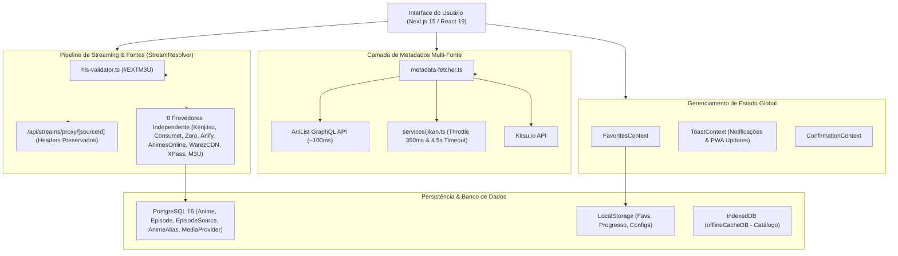

# Especificação Arquitetural e Técnica — AniStream 🚀

Este documento detalha a arquitetura interna, fluxo de dados, estratégias de resiliência, 8 provedores de streaming, gestão de episódios/fontes e comunicação de APIs do projeto **AniStream**.

---

## 🗺️ 1. Visão Geral da Arquitetura

---

## 🎬 2. 8 Provedores de Mídias e Episódios

O AniStream suporta 8 provedores independentes e configuráveis via Painel Administrativo (`/admin/sources`):

1. **Kenjitsu / AniZone**:
   - Busca: `/api/anizone/anime/search?q={query}`
   - Legendado: `/api/anizone/sources/-{slug}-episode-{episode}`
   - Dublado: `/api/anizone/sources/-{slug}-episode-{episode}-dub` e `-dublado`
2. **GogoAnime (Consumet com 5 Instâncias Fallback)**:
   - Fallback sequencial inteligente entre as instâncias: `api-consumet-org-five`, `consumet-api-1`, `anime-api-iota`, `consumet-api-zeta`, `consumet-api-ecru`.
   - Repassa `sources`, `headers` (`Referer`) e `subtitles`.
3. **HiAnime / Zoro (Consumet / Zoro)**:
   - Endpoints Consumet Zoro com extração de playlists HLS (`.m3u8`).
4. **Anify**:
   - Episódios `/episodes/{aniListId}?provider=zoro` e fontes `/sources?providerId={providerId}`.
5. **AnimesOnline (Scraper HTML + AJAX)**:
   - Extração via `/episodio/{slug}` e `wp-admin/admin-ajax.php`.
6. **WarezCDN / Superflix**:
   - Suporte aos 4 domínios (`warezcdn.lat`, `warezcdn.site`, `superflixapi.pro`, `superflixapi.rest`).
7. **XPass / 2Embed**:
   - Embeds `/e/tv/`, `/e/movie/` e playlists JSON (`/mov/{tmdbId}/{season}/{episode}/0/playlist.json`).
8. **Catálogo M3U Autorizado**:
   - Playlists M3U/M3U8 personalizadas com nome, URL, idioma, qualidade e categoria.

---

## ⚡ 3. Resolução On-Demand, Headers e Validação HLS

- **Resolução On-Demand (Lazy Resolution)**: A busca da URL do vídeo é executada exclusivamente quando o usuário clica em "Assistir" ou no preview, evitando armazenar URLs temporárias obsoletas.
- **Preservação de Cabeçalhos**: O proxy repassa os cabeçalhos `User-Agent`, `Referer` e `Origin` exigidos por cada servidor de vídeo.
- **Validador HLS ([hls-validator.ts](file:///c:/Users/sodinha/Documents/projetos/anistream/src/lib/streams/hls-validator.ts))**: Valida o status HTTP, `Content-Type` (`application/x-mpegurl`, `application/vnd.apple.mpegurl`) e a tag `#EXTM3U` no manifesto.
- **Pareamento por Aliases e Nomes Alternativos ([similarity.ts](file:///c:/Users/sodinha/Documents/projetos/anistream/src/lib/anime/similarity.ts))**: Ao resolver episódios, o sistema consulta a tabela `AnimeAlias` do PostgreSQL e testa todos os nomes alternativos (inglês, romaji, nativo e sinônimos) para garantir correspondência exata.

---

## 🛠️ 4. Gerenciamento de Episódios no Admin & Preview Inline

- **Modal `EpisodeSourcesModal` ([EpisodeSourcesModal.tsx](file:///c:/Users/sodinha/Documents/projetos/anistream/components/admin/EpisodeSourcesModal.tsx))**:
  - Lista de fontes cadastradas com chave ON/OFF (`enabled`), alteração de qualidade, idioma (`pt-BR`, `ja`), edição e exclusão.
  - Varredura nos provedores em tempo real com checkboxes para o admin selecionar quais fontes deseja cadastrar ao episódio.
  - Formulário para adição manual de links `.m3u8`, `.mp4` ou iFrame `embed`.
  - **Player de Teste Inline**: Overlay com o `VideoPlayer` oficial da aplicação para testar a reprodução da fonte em tempo real antes de salvar.

---

## 💾 5. Sistema de Metadados Multi-Fonte Resiliente

O módulo [`src/lib/anime/metadata-fetcher.ts`](file:///c:/Users/sodinha/Documents/projetos/anistream/src/lib/anime/metadata-fetcher.ts) implementa resiliência em 3 camadas:
1. **AniList GraphQL API (Prioridade Principal)**: Responde em **~100ms** sem rate-limit e sem erros 504.
2. **Jikan v4 + Timeout 4.5s (Fallback Secundário)**: Fila de engarrafamento (350ms) com cancelamento rápido em caso de instabilidade.
3. **Kitsu API (Fallback Terciário)**: Fonte adicional para garantir retorno de dados.
4. **Importação Determinística**: O modal de importação envia diretamente os metadados do card selecionado pelo usuário para o backend, evitando discrepâncias de busca.

---

## 🔔 6. Notificações de Atualização PWA / Service Worker

- O componente [`PwaRegister.tsx`](file:///c:/Users/sodinha/Documents/projetos/anistream/src/components/layout/PwaRegister.tsx) detecta quando uma nova versão do Service Worker é instalada.
- O [`ToastContext.tsx`](file:///c:/Users/sodinha/Documents/projetos/anistream/context/ToastContext.tsx) exibe um Toast interativo: *"Nova Atualização Disponível! 🚀 Clique aqui para atualizar a página."*
- Ao clicar no Toast, é enviado o comando `SKIP_WAITING` e o navegador executa `window.location.reload()`.

---

## 🧱 7. Organização de Componentes

Pasta `components/`:
- **`anime/`**: Componentes de catálogo (`AnimeCard`, `CompactAnimeCard`, carrosséis e recomendações).
- **`player/`**: Componentes da experiência de vídeo (`VideoPlayer`, `EpisodeList`).
- **`catalog/`**: Filtros e pesquisa (`SearchBar`, `SearchFilters`, `QuickMultiFilter`, `ViewToggle`).
- **`home/`**: Seções da página inicial (`BannerHero`, `ContinueWatchingSection`, `ForYouSection`).
- **`layout/`**: Estrutura (`Navbar`, `Footer`, `QueryProvider`, `PwaRegister`).
- **`admin/`**: Modais e painéis administrativos (`ImportAnimeModal`, `EpisodeSourcesModal`, `AutopilotPanel`).
- **`ui/`**: Primitivos e componentes atômicos (`SafeImage`, `Tooltip`, `RatingBadge`, `GenreBadge`, `EmptyState`, `LoadingSkeleton`).
