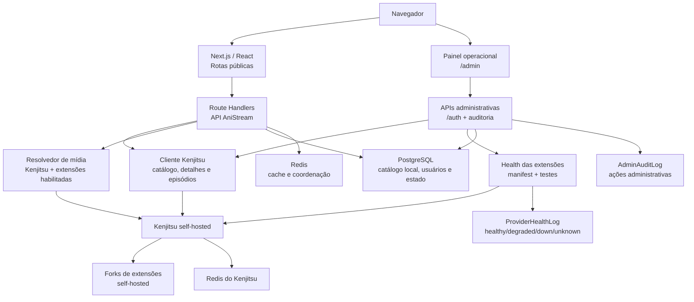
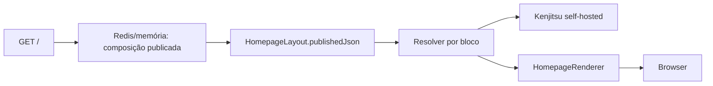

# Arquitetura do AniStream

Este documento descreve a arquitetura atual do AniStream depois da migração para o Kenjitsu self-hosted. O Kenjitsu é a fonte única de catálogo, metadados, episódios e mídias; o AniStream mantém a experiência pública, a administração, o catálogo operacional local e a persistência de estado.

## 1. Visão geral



## 2. Responsabilidade de cada camada

### Interface pública

- `app/(main)` contém home, catálogo, detalhes, favoritos, calendário e player.
- A Home (`app/(home)/page.tsx`) é server-first: carrega a composição publicada em `HomepageLayout`, resolve cada bloco pelo Kenjitsu e envia estados `ready`, `empty`, `error` ou `client` para o renderer.
- `src/components/home/HomepageRenderer.tsx` mantém a composição tipada; dados pessoais, como continuar assistindo, são hidratados somente no navegador.
- O catálogo público usa os dados sincronizados/administrados no AniStream e consulta o Kenjitsu para metadados, episódios e resolução de mídia.
- O player mantém HLS, embeds, legendas, seleção de qualidade, retomada, atalhos e pular abertura.

### Painel administrativo

- `app/(main)/admin/layout.tsx` fornece o shell autenticado, sidebar agrupada, breadcrumbs, sessão e command palette.
- `src/components/admin/AdminPrimitives.tsx` concentra tabela, filtros, estados, feedback, drawer, modal, save bar e zona de risco.
- A direção visual do admin é densa e plana: tabelas, filas, divisórias e status sem cards glass como material padrão.
- As superfícies principais são dashboard, catálogo/editor, extensões, navegação, calendário, sistema, backups, integrações, comunicados e releases.

`/admin/navigation` usa `src/lib/navigation/repository.ts` como fonte compartilhada para o admin e o shell público. A configuração versionada em `SystemSetting.public_navigation_config` mantém espelhos legados (`public_navigation` e `page_features`) para compatibilidade. `Navbar`, mobile e `Footer` filtram páginas desativadas pelo mesmo documento; `PublicPageGate` redireciona acessos diretos sem permitir loops ou rotas externas.

### Release Schedule

O calendário público (`/calendario`) é uma projeção semanal do endpoint `GET /api/anilist/airing/date/:date` do Kenjitsu. O app consulta dias UTC adjacentes, converte `airingAt` para o timezone do visitante, arredonda o horário e cacheia o resultado no Redis. `ReleaseScheduleRule` e `ReleaseScheduleException` guardam somente ajustes locais administrativos; não duplicam a agenda automática como fonte de catálogo.

### Integração Kenjitsu

- `src/lib/kenjitsu/client.ts` encapsula autenticação, timeout e chamadas HTTP.
- `src/lib/kenjitsu/catalog.ts` centraliza busca, detalhes, relações, personagens e episódios.
- `src/lib/providers/kenjitsu.provider.ts` traduz fontes retornadas pelo Kenjitsu para o resolvedor do AniStream.
- As extensões são tratadas como fontes: podem ser habilitadas, desabilitadas, filtradas, testadas e auditadas pelo painel.
- O AniStream não troca silenciosamente para Jikan, AniList, Kitsu, Consumet, scrapers ou M3U quando o Kenjitsu falha.

## 3. Composição da Home

`HomepageLayout` é um singleton com `draftJson`, `publishedJson` e versões independentes. A primeira leitura executa uma migração idempotente da chave legada `SystemSetting.home_sections`; depois da criação bem-sucedida, a chave é removida e não é mais lida em runtime.

O admin edita somente documentos aceitos por `src/schemas/homepage.ts`. O documento permite os blocos `hero`, `catalog_carousel`, `continue_watching`, `quick_filters`, `editorial_notice` e `divider`, com no máximo 12 itens. Fontes dinâmicas e IDs manuais passam pelo mesmo resolver Kenjitsu; não há HTML livre, upload, M3U ou fallback de provedor.

O fluxo público é:



Uma falha de consulta marca apenas o bloco afetado. O cache de layout é invalidado na publicação; respostas Kenjitsu usam TTL de cinco minutos por configuração. A composição emergencial local serve apenas quando layout/DB falham e nunca substitui o Kenjitsu como fonte de animes ou episódios.

## 4. Extensões como fontes operacionais

O Kenjitsu registra os manifests das extensões e expõe o health agregado. O AniStream persiste somente o estado administrativo necessário para operar essas fontes:

- `enabled` e `nsfw`;
- status do último teste: `healthy`, `degraded`, `down` ou `unknown`;
- latência, data do teste e última mensagem de erro;
- origem e capacidades do manifest quando o Kenjitsu estiver disponível.

O código das extensões vive nos forks/self-hosted dos repositórios Kenjitsu. Atualizações devem ser feitas nos forks, em branches e PRs próprios, sem modificar os repositórios oficiais.

## 5. Persistência e auditoria

O PostgreSQL mantém o estado operacional do AniStream. Além das entidades de catálogo, usuários e episódios, a arquitetura atual usa:

- `AdminAuditLog`: ator, ação, tipo/id do recurso, resumo, metadata sanitizada e data;
- `ProviderHealthLog`: histórico de testes por extensão, latência, status e erro;
- `HomepageLayout`: rascunho, publicação, versões e atores da Home;
- configurações administrativas das extensões Kenjitsu;
- estado local de navegação, comunicados, releases, backups e integrações.
- configuração versionada de navegação pública, slots mobile e disponibilidade de páginas em `SystemSetting`.
- `ReleaseScheduleRule` e `ReleaseScheduleException`: regras recorrentes e exceções pontuais do calendário.

`src/lib/admin/audit.ts` remove chaves sensíveis e limita metadata antes de persistir. O histórico é consultável no dashboard e em `GET /api/admin/audit`.

## 6. Contratos administrativos principais

| Endpoint | Uso |
| :--- | :--- |
| `GET /api/admin/overview` | KPIs, serviços, extensões, alertas e atividade recente. |
| `GET /api/admin/metrics` | Contrato legado de métricas, mantido para consumidores existentes. |
| `GET /api/admin/audit` | Auditoria paginada com filtros por recurso, ação e período. |
| `GET /api/admin/animes` | Catálogo administrativo com busca, status, episódios, ordenação e paginação. |
| `POST /api/admin/animes/bulk` | Sincronização ou exclusão em lote, com resultados parciais. |
| `GET /api/admin/extensions` | Extensões com filtros de habilitação, NSFW, status, origem e capacidade. |
| `POST /api/admin/extensions/bulk` | Habilitação ou desabilitação em lote. |
| `POST /api/admin/extensions` | Teste individual com persistência de health. |
| `GET /api/admin/homepage` | Estado do builder e versões do layout. |
| `PUT /api/admin/homepage` | Salva rascunho com controle otimista. |
| `POST /api/admin/homepage/publish` | Publica e invalida o cache público. |
| `POST /api/admin/homepage/discard` | Restaura o rascunho publicado. |
| `GET /api/homepage` | Entrega a composição pública resolvida. |
| `GET /api/admin/navigation` | Configuração, revisão e preview da experiência pública. |
| `POST /api/admin/navigation` | Publicação atômica de navegação com auditoria e conflito otimista. |
| `GET /api/settings/public` | Contrato público compatível para navegação, mobile e páginas. |
| `GET /api/calendar` | Agenda semanal convertida para o timezone solicitado. |
| `GET /api/admin/calendar` | Configuração e prévia autenticadas do Release Schedule. |
| `PUT /api/admin/calendar` | Persistência de regras, exceções e configurações com auditoria. |
| `POST /api/admin/calendar/sync` | Invalidação de versão e sincronização sob demanda. |
| `POST /api/admin/animes/[id]/sync` | Sincronização do anime usando o Kenjitsu. |
| `POST /api/admin/animes/[id]/episodes/[epId]/discover-sources` | Descoberta live das fontes pelas extensões habilitadas. |

Todas as rotas administrativas exigem sessão válida. A resposta pode indicar indisponibilidade do Kenjitsu sem apagar configurações locais nem inventar resultados.

## 7. Mídia e segurança

As URLs de reprodução são retornadas pelo Kenjitsu em tempo real. Não existe configuração administrativa de hosts autorizados, cadastro manual de URL de stream ou fallback de provedor externo.

Mesmo assim, cada URL passa por `src/lib/security/ssrf.ts`. A validação bloqueia protocolos indevidos, credenciais embutidas, portas não suportadas, redes privadas e resultados DNS internos. O relay mantém descritores assinados e criptografia AES-GCM quando aplicável.

HLS é validado por `src/lib/streams/hls-validator.ts`. A validação confirma status HTTP, content type compatível e a tag `#EXTM3U`; isso é uma proteção do playback, não uma fonte de catálogo.

## 8. Execução local e atualização

O ambiente oficial desta fase é local:

```bash
docker compose up -d --build
```

O Compose sobe AniStream, Kenjitsu, PostgreSQL e os dois Redis. Os repositórios irmãos `kenjitsu` e `kenjitsu-extensions` são usados como contexto local para a imagem self-hosted.

Para atualizar sem tocar nos projetos oficiais:

```bash
git -C ../kenjitsu fetch upstream --tags
git -C ../kenjitsu-extensions fetch upstream --tags
```

Depois, cada atualização deve ser revisada no fork, validada localmente e integrada ao AniStream por PR. O rollout no Dokploy só ocorre após autorização explícita.
