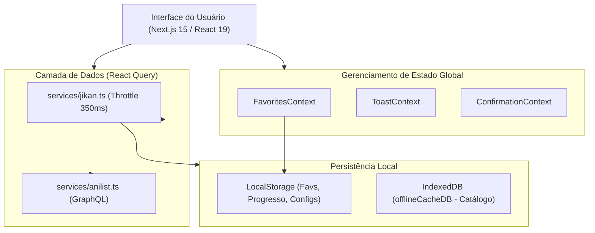

# Especificação Arquitetural e Técnica — AniStream

Este documento detalha a arquitetura interna, fluxo de dados, estratégias de cache, gestão de estado e comunicação de APIs do projeto **AniStream**.

---

## 🗺️ 1. Visão Geral da Arquitetura



---

## ⚡ 2. Estratégia de Requisições e Throttling (API Jikan v4)

A API do MyAnimeList via Jikan v4 possui limite estrito de **3 requisições por segundo**. Para evitar erros HTTP 429 (Rate Limit Exceeded), o serviço [`services/jikan.ts`](file:///c:/Users/junin/Documents/projetos/anistream/services/jikan.ts) implementa uma fila de engarrafamento com atraso dinâmico:

```typescript
let lastRequestTime = 0;
async function throttleRequest<T>(requestFn: () => Promise<T>): Promise<T> {
  const now = Date.now();
  const timeSinceLast = now - lastRequestTime;
  const minInterval = 350; // Garante máximo de ~2.8 req/seg
  if (timeSinceLast < minInterval) {
    await new Promise((resolve) => setTimeout(resolve, minInterval - timeSinceLast));
  }
  lastRequestTime = Date.now();
  try {
    return await requestFn();
  } catch (error: any) {
    if (error?.response?.status === 429) {
      await new Promise((resolve) => setTimeout(resolve, 1500)); // Backoff exponencial
      return await requestFn();
    }
    throw error;
  }
}
```

---

## 💾 3. Sistema de Cache Offline (IndexedDB)

O utilitário [`utils/offlineCacheDB.ts`](file:///c:/Users/junin/Documents/projetos/anistream/utils/offlineCacheDB.ts) gerencia um banco de dados IndexedDB de alta velocidade contendo 2 stores:

1. **`catalog`**: Armazena respostas de busca, rankings populares e lançamentos de temporadas por `cacheKey`.
2. **`animes`**: Armazena objetos detalhados de animes acessados.

### Fluxo de Fallback Offline
1. Quando a aplicação tenta realizar busca ou carregar um anime:
2. Se `navigator.onLine === false` ou a API Jikan retornar erro de rede, o serviço tenta recuperar o resultado direto do IndexedDB.
3. Se não houver cache no IndexedDB, é realizada a busca local no repositório estático [`data/fallbackAnime.ts`](file:///c:/Users/junin/Documents/projetos/anistream/data/fallbackAnime.ts).

---

## 🧱 4. Padrões de Design e Módulo de Componentes

Todos os componentes ficam na pasta `components/` dividida em 6 subpastas temáticas por domínio:

- **`anime/`**: Componentes focados em visualização de animes (`AnimeCard`, `CompactAnimeCard`, `AnimeCarousel`, `QuickViewModal`, `SeasonSelector`).
- **`player/`**: Componentes da experiência de vídeo (`VideoPlayer`, `EpisodeList`).
- **`catalog/`**: Filtros e mecanismos de busca (`SearchBar`, `SearchFilters`, `QuickMultiFilter`, `ViewToggle`).
- **`home/`**: Blocos da tela inicial (`BannerHero`, `ContinueWatchingSection`, `EpisodeRemindersPanel`, `ForYouSection`).
- **`layout/`**: Componentes estruturais de páginas (`Navbar`, `Footer`, `QueryProvider`).
- **`ui/`**: Componentes atômicos e primitivos de interface (`SafeImage`, `Tooltip`, `RatingBadge`, `GenreBadge`, `EmptyState`, `LoadingSkeleton`).

### Regra de Compatibilidade de Imports (Barrel Export Pattern)
Cada subpasta contém um arquivo `index.ts` reexportando seus componentes. Além disso, a raiz de `components/index.ts` reexporta todos os domínios, permitindo tanto imports modulares (`@/components/anime/AnimeCard`) quanto gerais (`@/components`).

---

## 🛡️ 5. Resiliência de Hooks de Contexto (SSG / Prerender)

Para evitar erros de compilação durante o prerender estático de páginas estáticas e de erro (`_error.js` / `404`), os hooks de contexto implementam objetos de fallback seguros:

```typescript
export function useToast() {
  const context = useContext(ToastContext);
  if (!context) {
    return {
      showToast: () => {},
      copyToClipboard: async () => false,
    };
  }
  return context;
}
```

Isso garante que o Next.js possa prerenderizar qualquer componente que utilize contexto sem falhas de renderização.
