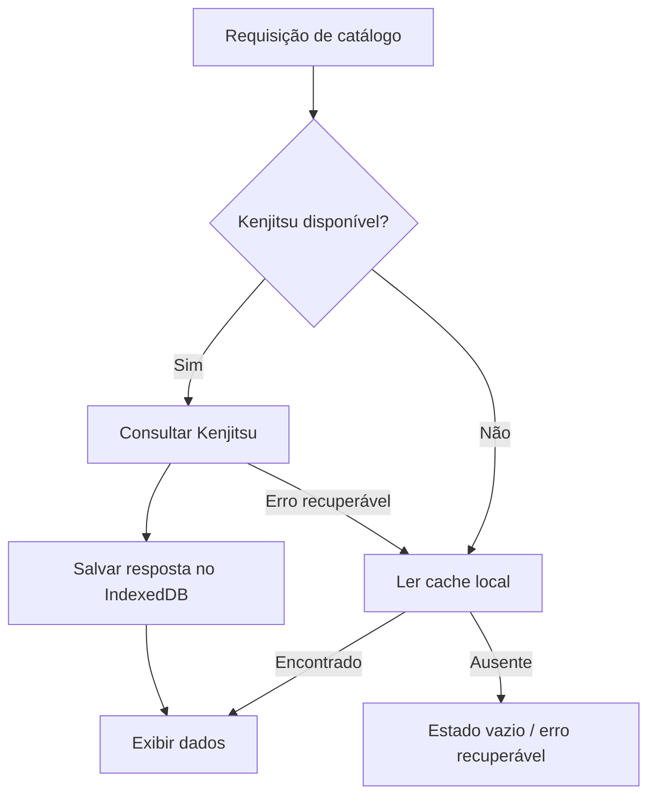

# 07. Armazenamento offline e IndexedDB

O AniStream mantém um cache local para preservar favoritos, progresso e dados já consultados quando a conexão com o Kenjitsu está temporariamente indisponível. O cache não substitui o Kenjitsu como fonte de catálogo e não cria novos episódios ou mídias offline.

## 1. Implementação

O utilitário [`src/utils/offlineCacheDB.ts`](../src/utils/offlineCacheDB.ts) encapsula a API IndexedDB.

- Nome do banco: `AniStreamOfflineDB`;
- versão atual: `1`;
- expiração de catálogo/detalhes: sete dias;
- fallback técnico: `memoryCacheMap` quando IndexedDB não está disponível ou a quota foi excedida.

## 2. Object stores

| Store | Chave | Conteúdo |
| :--- | :--- | :--- |
| `catalog` | `key` | Resultados de consultas e listas. |
| `favorites` | `mal_id` | Favoritos salvos pelo usuário. |
| `anime_details` | `mal_id` | Detalhes já visualizados. |
| `episodes` | `animeId` | Episódios consultados por anime. |

## 3. Fluxo online/offline

Se não houver cache, a interface informa que os dados não estão disponíveis. Não existe fallback estático de outra API.

## 4. PWA e Service Worker

- `public/manifest.json` define nome, ícones, cores e modo standalone;
- `public/sw.js` cacheia ativos estáticos e rotas conforme a estratégia configurada;
- `src/components/layout/PwaRegister.tsx` registra o service worker e informa atualizações;
- notificações de lançamentos usam o estado local de favoritos quando disponíveis.

O modo offline é uma camada de continuidade da experiência pública. O painel administrativo, alterações de catálogo, testes de extensões e operações de risco exigem conexão com a aplicação, banco e Kenjitsu.
