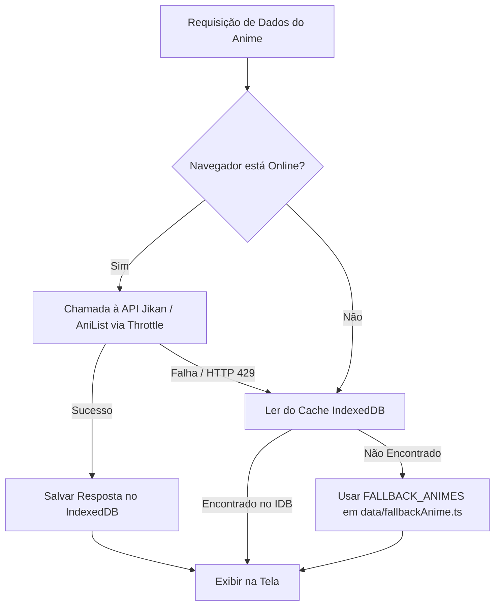

# 07. Armazenamento Offline e IndexedDB — AniStream 💾

O AniStream conta com um sistema de **suporte offline** que permite aos usuários navegar em catálogos e acessar informações salvas mesmo sem conexão com a internet.

---

## 🗄️ Estrutura do Banco IndexedDB (`utils/offlineCacheDB.ts`)

O utilitário [`utils/offlineCacheDB.ts`](file:///c:/Users/junin/Documents/projetos/anistream/utils/offlineCacheDB.ts) encapsula o uso da API nativa IndexedDB do navegador.

- **Nome do Banco**: `AniStreamOfflineDB`
- **Versão**: `1`

### Object Stores (Tabelas)

1. **`catalog`** (KeyPath: `cacheKey`)
   - Armazena listas de busca, temporais e rankings populares.
   - Campos: `cacheKey`, `data`, `updatedAt`.
2. **`animes`** (KeyPath: `id`)
   - Armazena metadados detalhados de cada anime individual visualizado.
   - Campos: `id`, `title`, `synopsis`, `images`, `updatedAt`.

---

## 🔄 Fluxo de Resolução de Dados (Online vs Offline)

---

## 📱 Suporte PWA Instalável & Service Worker (Fase 3)

1. **Manifest Web App (`public/manifest.json`)**:
   - Define nome, ícones, cor de tema (`#FF6B00`), cor de fundo (`#0B0B0F`) e exibição `standalone`.
2. **Service Worker (`public/sw.js`)**:
   - Cache de rotas HTML e ativos estáticos com estratégia **Stale-While-Revalidate**.
3. **PWA Registration Component (`PwaRegister.tsx`)**:
   - Registra `/sw.js` e intercepta o evento `beforeinstallprompt` exibindo o botão de instalação nativa no celular ou desktop.
4. **Notificações Web Push (`useWebNotifications.ts`)**:
   - Hook nativo para gerenciar permissões de notificação do navegador e enviar alertas de lançamentos de episódios favoritados.
